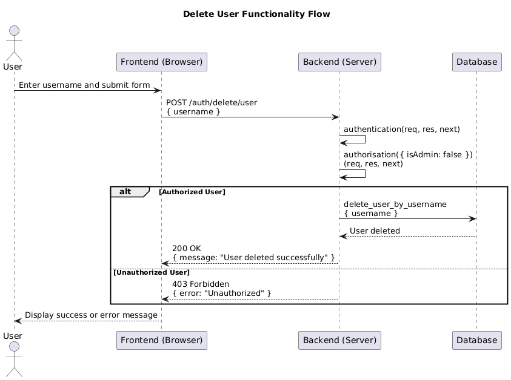

# Project Title: User Management with JWT Authentication and Authorization

## Overview
This project demonstrates how to implement a basic user management system with JWT-based authentication and authorization using Node.js. The system includes user registration, login, profile management, and an admin dashboard. It also features a delete user functionality, which can be invoked after user authentication.

## Delete User Functionality

### 1. Implementation

The delete user functionality allows authenticated users to delete a user by their username. This is implemented in the `deleteuser.js` file, which includes both backend and frontend code.

#### Code Implementation: `deleteuser.js`
```javascript
const express = require("express");
const jwt = require("jsonwebtoken");
const bodyParser = require("body-parser");

const app = express();
app.use(bodyParser.json());

const users = [
  { username: "admin", role: "admin" },
  { username: "user1", role: "user" },
  { username: "user2", role: "user" }
];

const JWT_SECRET = "your_secret_key_here";

// Middleware: Authentication
const authenticateToken = (req, res, next) => {
  const token = req.headers.authorization && req.headers.authorization.split(" ")[1];
  if (!token) return res.status(401).json({ error: "Token missing" });

  jwt.verify(token, JWT_SECRET, (err, user) => {
    if (err) return res.status(403).json({ error: "Unauthorized" });
    req.user = user;
    next();
  });
};

// Middleware: Authorization
const authorize = (allowedRoles) => {
  return (req, res, next) => {
    if (!allowedRoles.includes(req.user.role)) {
      return res.status(403).json({ error: "Unauthorized" });
    }
    next();
  };
};

// Backend: Delete User Endpoint
app.post("/auth/delete/user", authenticateToken, authorize(["admin", "user"]), (req, res) => {
  const { username } = req.body;
  const userIndex = users.findIndex(user => user.username === username);
  if (userIndex !== -1) {
    users.splice(userIndex, 1);
    res.json({ message: "User deleted successfully" });
  } else {
    res.status(404).json({ error: "User not found" });
  }
});

// Frontend: Delete User Form Handler
document.getElementById("delete-user-form").addEventListener("submit", async (event) => {
  event.preventDefault();
  const username = document.getElementById("other-username").value;
  const response = await fetch(`http://localhost:4001/auth/delete/user`, {
    method: "POST",
    headers: {
      "Content-Type": "application/json",
      "Authorization": `Bearer ${localStorage.getItem("token")}`
    },
    body: JSON.stringify({ username })
  });
  const result = await response.json();
  if (response.ok) {
    alert(result.message);
  } else {
    alert(result.error);
  }
});

app.listen(4001, () => console.log("Server running on port 4001"));


```

### 2. Diagram: Delete User Functionality Flow

Below is the flow diagram that illustrates the delete user functionality:



### 3. Explanation of "Delete User Functionality After Authentication"

#### Is it a good idea?

**Good Idea:** 
Allowing the delete user functionality after authentication can be seen as a good idea in a scenario where we want to enforce that only authenticated users have the ability to perform actions within the system. This ensures that any critical action, like deleting a user, is traceable to a legitimate, logged-in user.

**Bad Idea:** 
However, from a security perspective, allowing all authenticated users (including non-admins) to delete any user account is potentially dangerous. This can lead to abuse if users start deleting each other's accounts maliciously. This functionality should ideally be restricted to admin users only, ensuring proper authorization controls are in place.

#### Differences between Authentication and Authorization

**Authentication** is the process of verifying the identity of a user. In this case, it checks if the user is who they claim to be, usually by validating their credentials (username and password).

**Authorization** determines what an authenticated user is allowed to do within the system. After a user is authenticated, their role (admin, user, etc.) is checked to determine if they have permission to perform specific actions, such as deleting a user.

In this functionality:
- **Authentication** checks if the user is logged in.
- **Authorization** checks if the user has the required permissions (roles) to delete another user.


```
